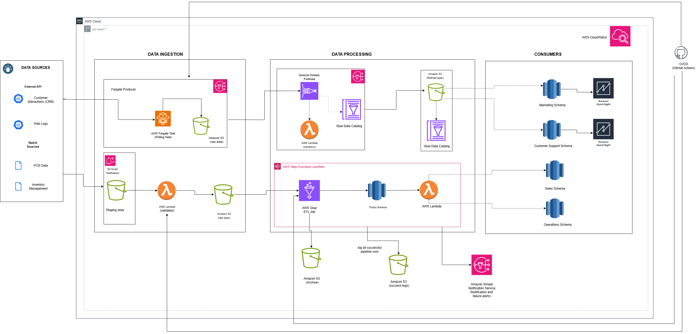
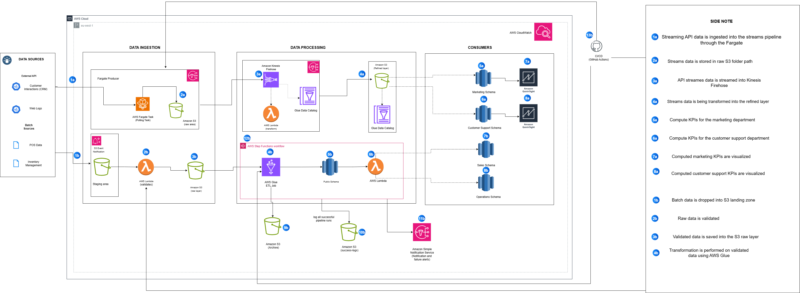
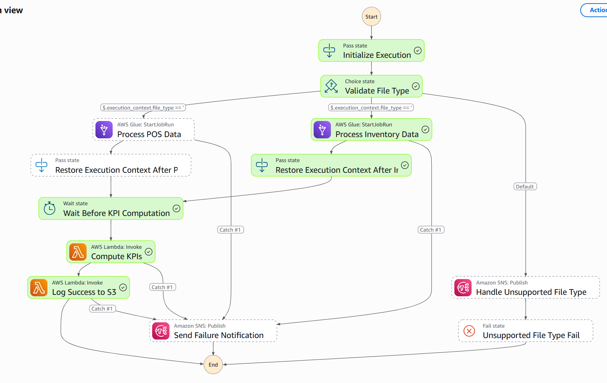
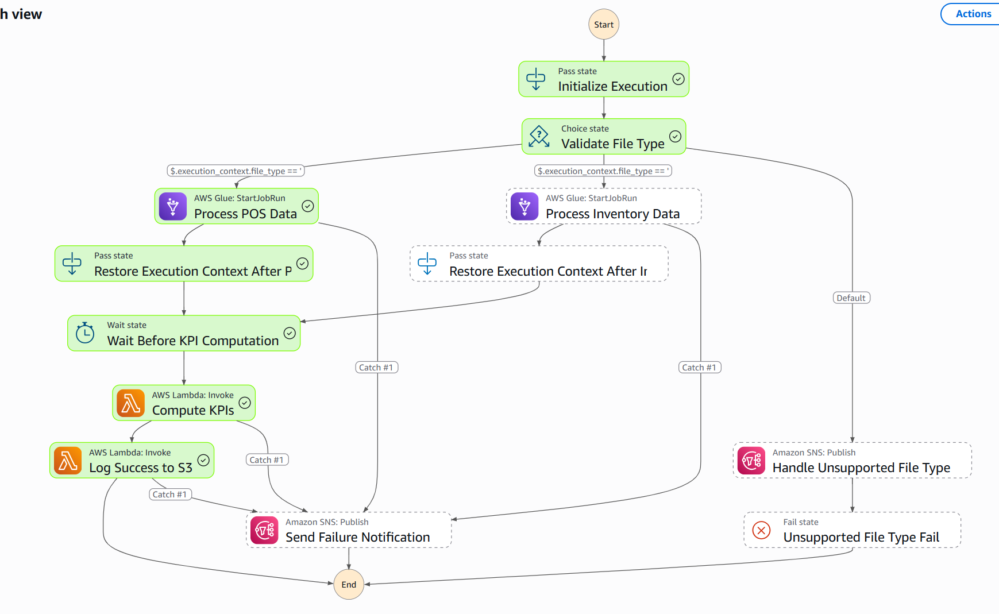

# Shopware Enterprise Data Pipeline

**A comprehensive, cloud-native data engineering solution for multi-source retail analytics and real-time insights**

## Overview

The Shopware Enterprise Data Pipeline is a production-ready, scalable data platform built on AWS that unifies batch and streaming data from multiple retail sources. Designed to support modern retail operations, this platform processes Point-of-Sale transactions, inventory management data, customer interactions, and web traffic to deliver department-specific insights and KPIs.

This enterprise-grade solution addresses critical retail challenges including real-time inventory tracking, customer behavior analysis, sales performance monitoring, and operational efficiency optimization. The platform serves multiple business units (Sales, Marketing, Operations, Customer Support) with tailored data access patterns and specialized analytics capabilities.

**Key Business Problems Solved:**
- Fragmented data sources preventing unified business insights
- Delayed batch processing limiting real-time decision making
- Department-specific data access requirements and security concerns
- Scalability challenges with growing data volumes
- Data quality and compliance requirements across multiple data types

## Features

### Core Data Processing Capabilities
- **Multi-Modal Data Ingestion**: Supports both batch processing (POS, Inventory) and real-time streaming (CRM, Web Traffic)
- **Intelligent Data Validation**: Schema enforcement with comprehensive validation rules and error handling
- **Automated Data Transformation**: Rich ETL pipelines with business logic, temporal enrichment, and analytics preparation
- **Dual Output Architecture**: Simultaneous real-time streaming and optimized batch storage for different analytical needs

### Advanced Analytics & KPI Generation
- **Department-Specific KPI Views**: Automated creation of Redshift views partitioned by business unit (Sales, Operations)
- **Real-Time Dashboards**: Live analytics through Firehose-powered streaming data
- **Historical Analysis**: Parquet-optimized storage for time-series analysis and trend identification
- **Data Quality Monitoring**: Comprehensive validation with configurable thresholds and quality flags

### Enterprise Security & Governance
- **Role-Based Access Control (RBAC)**: Schema-level security with department-specific access patterns
- **End-to-End Encryption**: Data encryption at rest (S3, Redshift) and in transit (SSL/TLS)
- **Comprehensive Audit Trails**: Complete data lineage tracking from source to consumption
- **GDPR/CCPA Compliance**: Privacy-by-design architecture with data retention policies

### Production Operations
- **Automated Orchestration**: Step Functions-based workflow management with error handling
- **Intelligent Alerting**: Real-time failure notifications with daily summary reporting
- **Container-Based Processing**: ECS Fargate containers for scalable API polling and data processing
- **Data Archival**: Automated file lifecycle management with intelligent storage tiering

## Architecture

The platform implements a modern data lake architecture with multiple processing layers:

### High-Level Architecture



Descriptive diagram




### Data Flow Architecture

**Batch Processing Flow:**
1. **File Upload** → S3 triggers Lambda validation
2. **Validation** → Valid files moved to `raw-data/`, invalid to `rejected/`
3. **Processing** → Step Functions orchestrates Glue ETL jobs
4. **Transformation** → Rich data enrichment and business logic application
5. **Storage** → Partitioned Parquet files in S3, loaded to Redshift
6. **Analytics** → KPI computation and department-specific view creation

### Orchestration Engine

The platform utilizes **AWS Step Functions** as the core orchestration engine, implementing intelligent workflow management for batch data processing. The orchestration layer provides automated decision-making, error handling, and parallel processing capabilities.

### Step Functions Workflow Architecture




### Key Orchestration Features

**Intelligent File Routing**: Choice state determines processing path based on file type (POS vs Inventory)

**Parallel Processing**: Both data streams can execute simultaneously while maintaining execution context

**Error Handling**: Comprehensive catch blocks with SNS notifications for operational visibility

**State Management**: Pass states preserve execution context across distributed processing steps

**Wait States**: Built-in delays ensure proper sequencing before KPI computation

### Workflow Benefits

- **Zero Manual Intervention**: Fully automated from file upload to KPI generation
- **Fault Tolerance**: Automatic retry logic with exponential backoff
- **Operational Visibility**: Real-time execution tracking through CloudWatch
- **Cost Optimization**: Pay-per-execution model with millisecond billing

The orchestration engine ensures reliable, scalable processing of batch data with minimal operational overhead while maintaining strict data quality and processing order requirements.

**Streaming Processing Flow:**
1. **API Polling** → ECS containers poll external APIs every 3 seconds
2. **Dual Output** → Simultaneous Firehose (real-time) and S3 batch writes
3. **Real-time Analytics** → Immediate data availability for dashboards
4. **Batch Optimization** → Intelligent batching (250 records or 5 minutes)

### Storage Organization

```
shopware.bucket/
├── raw-data/                    # Validated, unprocessed data
│   ├── pos/YYYY/MM/DD/
│   ├── inventory/YYYY/MM/DD/
│   ├── crm-interaction-streams/
│   └── web-logs/
├── processed/                   # Transformed, analytics-ready data
├── rejected/                    # Invalid data with error reasons
├── archive/                     # Historical data retention
└── success-logs/               # Processing audit trails
```

## Tech Stack

### Cloud Infrastructure
- **AWS S3** - Data lake storage with intelligent tiering
- **AWS Lambda** - Serverless data processing and validation
- **AWS Glue** - Managed ETL service with Spark-based transformations
- **AWS Step Functions** - Workflow orchestration and error handling
- **Amazon ECS Fargate** - Container-based API polling and streaming
- **Amazon Kinesis Firehose** - Real-time data streaming and delivery

### Data Processing & Analytics
- **Amazon Redshift** - Cloud data warehouse with columnar storage
- **AWS Glue Catalog** - Unified metadata management
- **Apache Spark** - Distributed data processing engine
- **Apache Parquet** - Optimized columnar file format
- **Amazon Athena** - Serverless query service

### Monitoring & Operations
- **Amazon CloudWatch** - Comprehensive monitoring and logging
- **Amazon SNS** - Notification and alerting system
- **Amazon EventBridge** - Event-driven triggers and scheduling
- **AWS Secrets Manager** - Secure credential management

### Development & Deployment
- **Python 3.12** - Primary programming language
- **Docker** - Container packaging for ECS deployments
- **AWS CDK/CloudFormation** - Infrastructure as Code
- **Git** - Version control and CI/CD integration

## Setup Instructions

### Prerequisites
- AWS Account with appropriate permissions
- AWS CLI configured with credentials
- Python 3.12+ installed locally
- Docker installed for container development
- Git for version control

### 1. Clone and Configure

```bash
# Clone the repository
git clone https://github.com/your-org/shopware-data-pipeline.git
cd shopware-data-pipeline

# Create and activate virtual environment
python -m venv venv
source venv/bin/activate  # Linux/Mac
# or
venv\Scripts\activate     # Windows

# Install dependencies
pip install -r requirements.txt
```

### 2. Environment Configuration

Create a `.env` file with the following variables:

```bash
# AWS Configuration
AWS_REGION=us-east-1
AWS_ACCOUNT_ID=123456789012

# S3 Buckets
SOURCE_BUCKET=shopware.bucket
PROCESSED_BUCKET=shopware-processed
ARCHIVE_BUCKET=shopware-archive

# Redshift Configuration
REDSHIFT_CLUSTER_IDENTIFIER=shopware-redshift-cluster
REDSHIFT_DATABASE=shopwaredb
REDSHIFT_USER=admin
REDSHIFT_SECRET_ARN=arn:aws:secretsmanager:region:account:secret/redshift-credentials

# Container Configuration
CRM_API_ENDPOINT=http://3.248.199.26:8000/api/customer-interaction/
WEB_API_ENDPOINT=http://3.248.199.26:8000/api/web-traffic/
POLL_INTERVAL=3

# Notification Configuration
SNS_TOPIC_ARN=arn:aws:sns:region:account:shopware-notifications
```

### 3. AWS Infrastructure Deployment

```bash
# Deploy core infrastructure
aws cloudformation create-stack \
  --stack-name shopware-infrastructure \
  --template-body file://infrastructure/core-infrastructure.yaml \
  --capabilities CAPABILITY_IAM

# Deploy Lambda functions
cd lambda/
./deploy-lambdas.sh

# Deploy Step Functions
aws stepfunctions create-state-machine \
  --definition file://step-functions/batch-orchestrator.json \
  --role-arn arn:aws:iam::account:role/StepFunctionsRole \
  --name shopware-batch-orchestrator
```

### 4. Container Deployment

```bash
# Build and deploy ECS containers
cd containers/
docker build -t shopware-crm-processor ./crm-processor/
docker build -t shopware-web-processor ./web-processor/

# Tag and push to ECR
aws ecr get-login-password --region us-east-1 | docker login --username AWS --password-stdin account.dkr.ecr.region.amazonaws.com
docker tag shopware-crm-processor:latest account.dkr.ecr.region.amazonaws.com/shopware-crm-processor:latest
docker push account.dkr.ecr.region.amazonaws.com/shopware-crm-processor:latest
```

## Data Flow & Pipeline Description

### Batch Processing Pipeline

The batch processing pipeline handles structured data files (POS transactions and inventory data) through a comprehensive validation, transformation, and loading process:

1. **Data Ingestion**: Files uploaded to S3 trigger Lambda validation functions
2. **Schema Validation**: Comprehensive validation including:
   - Required field presence
   - Data type validation
   - Business rule enforcement
   - Duplicate detection
3. **Data Transformation**: Glue jobs perform rich transformations:
   - Temporal enrichment (timestamp conversion, date parts)
   - Financial calculations (revenue, discounts, ratios)
   - Categorization (transaction sizes, stock levels)
   - Analytics preparation (rolling totals, rankings)
4. **Quality Assurance**: Configurable thresholds and validation rules
5. **Data Loading**: Optimized Redshift loading with proper indexing

### Streaming Processing Pipeline

Real-time data processing for customer interactions and web traffic:

1. **Continuous Polling**: ECS containers poll APIs every 3 seconds
2. **Dual Output Strategy**:
   - **Real-time**: Immediate Firehose delivery for live dashboards
   - **Batch**: Intelligent batching (250 records or 5-minute timeout) for cost optimization
3. **Data Enrichment**: 
   - Page categorization and metadata extraction
   - Device and engagement type inference
   - Temporal enrichment and partitioning
4. **Error Handling**: Comprehensive retry logic with dead letter queues

### Data Partitioning Strategy

All data is partitioned by time for optimal query performance:
- **S3**: `year=YYYY/month=MM/day=DD/hour=HH` structure
- **Redshift**: Date-based distribution and sort keys
- **Glue Catalog**: Partition pruning for efficient queries

## Usage Guide

### For Data Analysts

**Querying Recent Sales Performance:**
```sql
-- Connect to Redshift and query departmental views
SELECT 
    product_id,
    SUM(revenue) as total_revenue,
    COUNT(*) as transaction_count
FROM sales_kpis.sales_by_region_product 
WHERE transaction_date >= CURRENT_DATE - 7
GROUP BY product_id
ORDER BY total_revenue DESC;
```

**Real-time Inventory Alerts:**
```sql
-- Monitor low stock situations
SELECT 
    product_id,
    warehouse_id,
    stock_level,
    restock_threshold
FROM ops_kpis.stockout_alerts
WHERE stock_level  Tuple[bool, Optional[str]]:
    """
    Validate POS transaction record against business rules.
    
    Args:
        record: Dictionary containing POS transaction data
        
    Returns:
        Tuple of (is_valid, error_message)
        
    Raises:
        ValueError: If record structure is invalid
    """
    required_fields = ['transaction_id', 'store_id', 'product_id']
    
    for field in required_fields:
        if field not in record:
            return False, f"Missing required field: {field}"
    
    return True, None
```

### Commit Message Format

```
type(scope): brief description

Detailed explanation of the change, if necessary.
Include any breaking changes or migration notes.

Closes #123
```

Types: `feat`, `fix`, `docs`, `style`, `refactor`, `test`, `chore`


### Roadmap

Upcoming features and improvements:
- Machine learning pipeline integration
- Advanced anomaly detection
- Multi-region deployment support
- Enhanced real-time alerting
- GraphQL API layer
- Enhanced data lineage tracking

